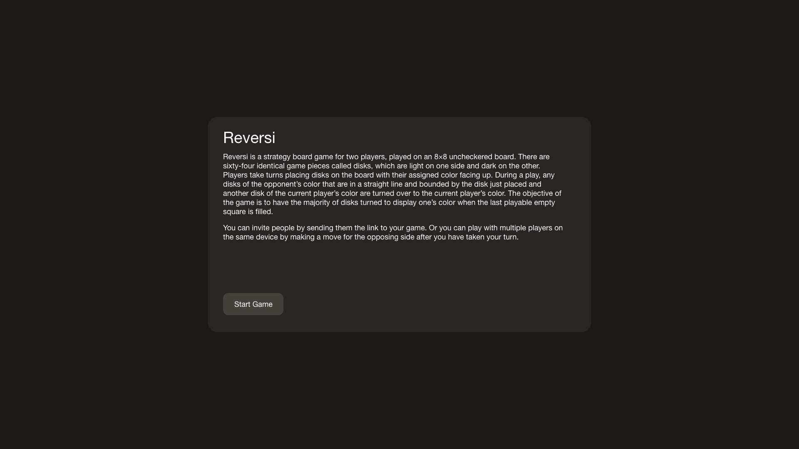
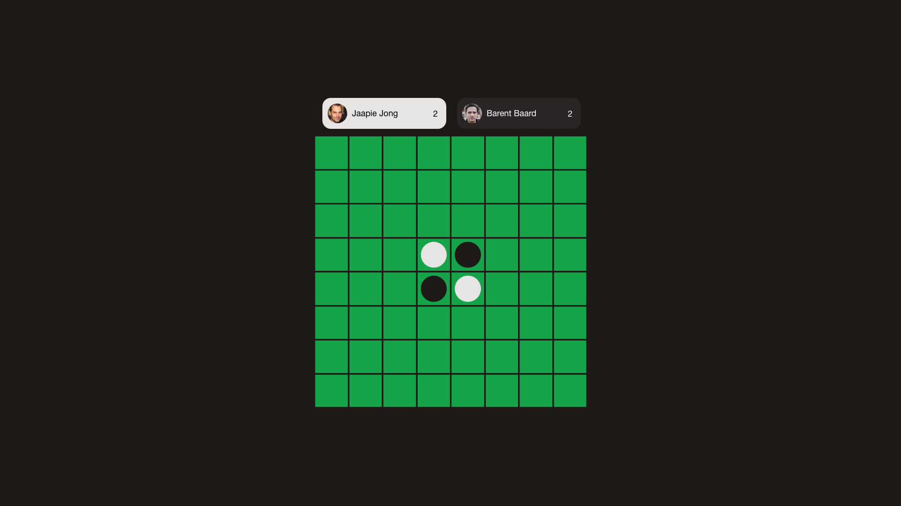
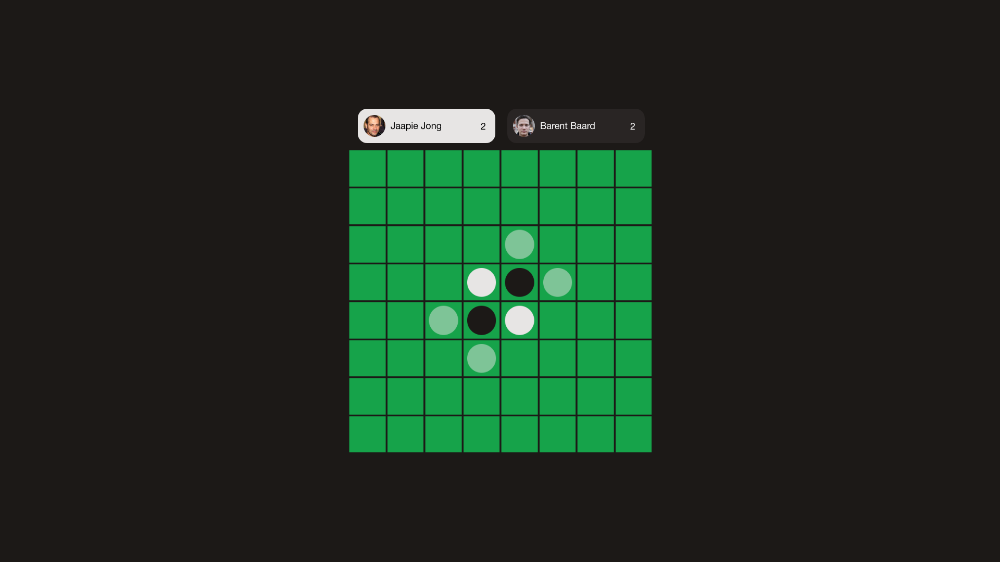
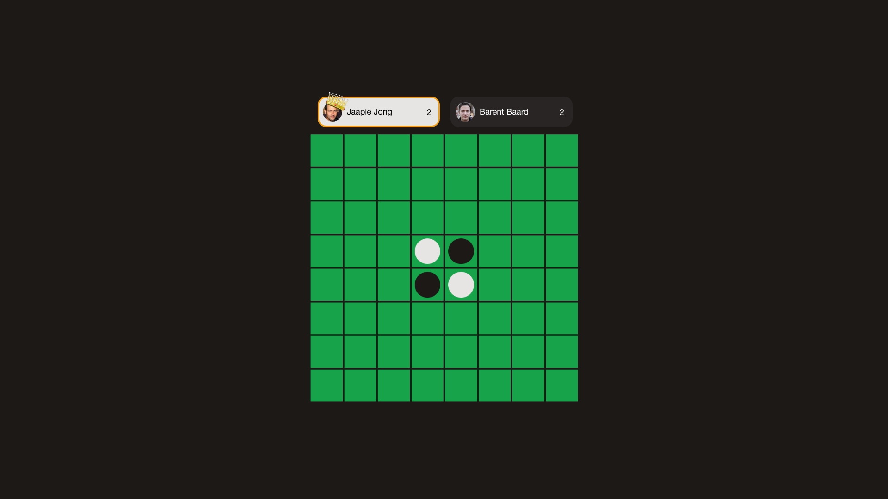

## Definities
Bezoeker = Iemand die de site gebruikt  
Gebruiker = Bezoeker die ingelogd is  
Speler = Een gebruiker die aan een Reversi spel meedoet  

## User-stories
### Als gebruiker, wil ik een Reversi spel kunnen starten, zodat ik Reversi kan spelen

### Als gebruiker, wil ik een Reversi spel kunnen bijwonen, zodat ik met iemand anders Reversi kan spelen

- Gebruiker kan op hetzelfde account als de andere speler meedoen
- Gebruiker mag alleen deelnemen als de kleur nog niet is ingenomen door een andere speler
- Gebruiker deelnemen door een zet te doen met een beschikbare kleur

### Als speler, wil ik een zet kunnen zetten, zodat het spel door kan gaan

- Speler kan alleen een zet doen als die aan de beurt is en een zet kan doen
- De zet moet legaal zijn
- Het bord moet gelijk updaten
- Er wordt laten zien welke zetten legaal zijn

### Als speler, wil ik altijd de meeste recente staat van het bord zien, zodat ik weet wat er op het bord gebeurt

- Wanneer de speler een stabiele verbinding gebruikt mag de staat van het bord niet langer dan 5 seconden "out of sync" zijn tussen server en client

## Als speler, wil ik zien wie er gewonnen heeft wanneer het spel voorbij is, zodat het duidelijk is dat het spel over is

