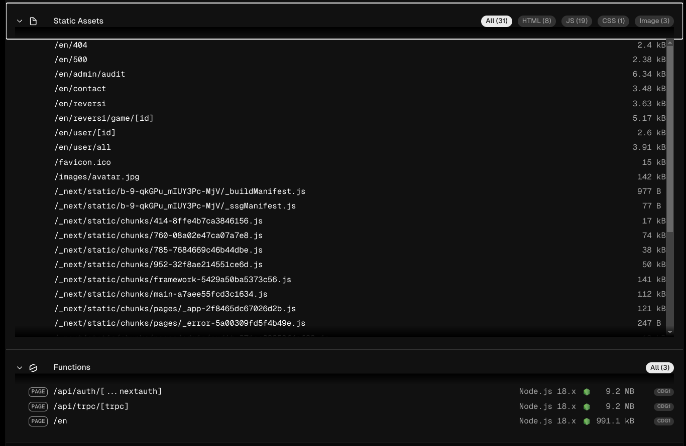
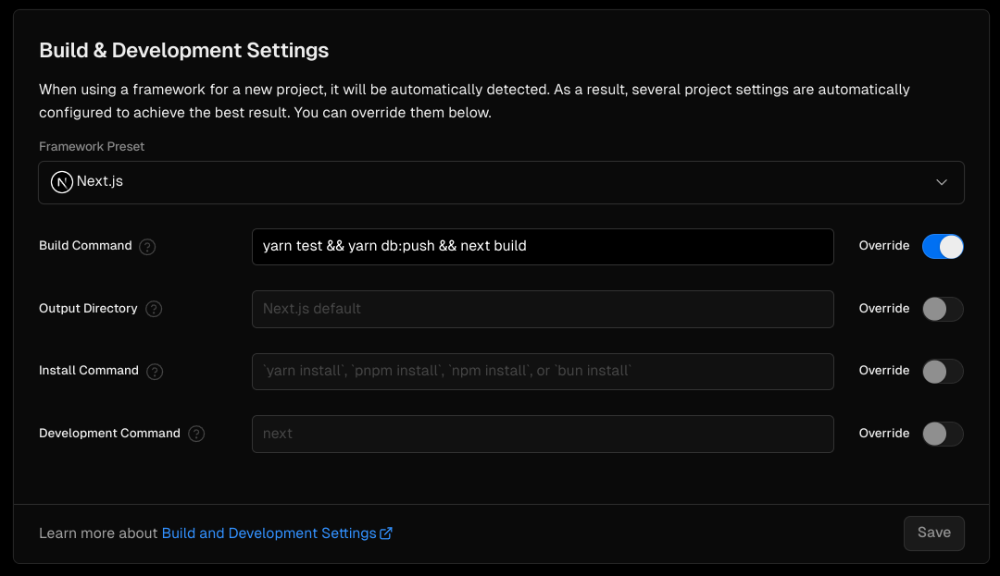
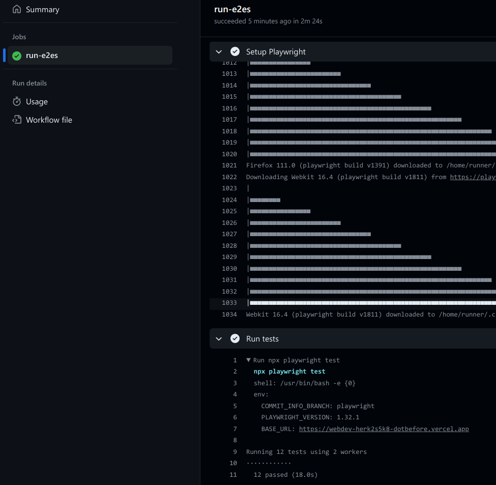

# Manage and Control

## Hosting

De website staat gehost op Vercel. Ik heb ervoor gekozen om het op Vercel te hosten omdat het de meeste functionaliteit bied voor het hosten van een NextJS applicatie. De verschillende pagina's worden statisch gegenereerd en beschikbaar gesteld op een CDN, zodat deze bestanden snel beschikbaar zijn. De api wordt gehost als cloud functie, dit betekent dat deze snel opgestart kan worden en niet altijd hoeft te draaien, waardoor er minder kosten gemaakt kunnen worden.

Voordat de deployment live gaat worden er ook de verschillende testen uitgevoerd. Er is voor gekozen om dit voor de deployment te doen, omdat er ook verschillende testen bij zitten die de beveiliging van de app waarborgen, wanneer deze mis gaan is er dus de kans dat de beveiliging niet op orde is, dus is het beter om niet de app live te zetten.

Nadat de app online is worden er E2E tests uitgevoerd.

De beveiliging van de applicatie wordt niet gecontrolleerd met E2E tests, hierdoor wordt de deployment dus ook niet geblokkeerd of teruggedraaid als deze falen.

Hosten op Vercel ondersteund ook de deployment van verschillende branches, hier maken we geen gebruik van sinds GitHub niet ondersteund om meerdere OAuth2 callback endpoints te hebben.

Als een gebruiker met HTTP naar de website navigeert wordt deze automatisch doorgestuurd naar de HTTPS versie van de website, wat de kans op MitM aanval verkleint.

## Supabase

Voor het hosten van de data wordt er gebruik gemaakt van Supabase. Hier is voor gekozen ook met oog op security. Door een database server zelf de hosten neem je ook de volledige verantwoordelijkheid voor de security op je. Het veilig hosten van een database is nog een hele opgave. Er is voor Supabase gekozen voor het hosten van onze database, omdat gratis is, makkelijk om op te zetten en je kan gebruik maken van 2FA.

Voor de database user waar de applicatie gebruik van maakt worden geen restricties gesteld, dit is gevaarlijk, omdat een aanvaller bijvoorbeeld alle data kan verwijderen, ook van de logs. Voor de deployment van een productie applicatie hoort hier betere beveiliging aan vast te zitten.
