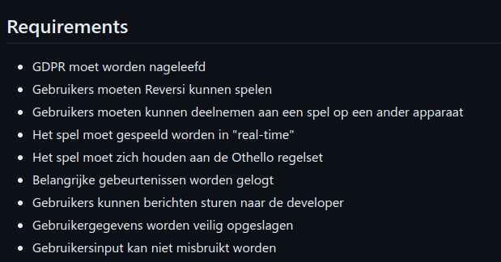
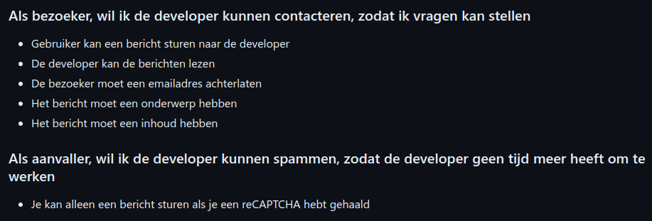

# Ontwerpen

Voor het ontwerpen heb heb ik gebruik gemaakt van een technisch ontwerp en een functioneel ontwerp.

## Functioneel ontwerp

In het functioneel ontwerp staan eerst de requirements van de applicaties beschreven. In de requirements staat beschreven wat de eisen zijn van de applicatie, functioneel en niet functioneel. Bijvoorbeeld dat de gebruikergegevens worden veilig opgeslagen moet in alle gevallen worden nageleefd.

Op basis van de requirements zijn de user-stories opgesteld.

Voor elke user story zijn er verschillende acceptance criteria opgesteld. Deze criteria zijn de eisen waaraan de user story moet voldoen. Er is ook nagedacht over wat een aanvaller zou willen doen met de user story, zodat er ook rekening gehouden kan worden met de beveiliging.

Voor de meeste user stories worden er ook limitaties opgesteld. Bijvoorbeeld dat een gebruiker alleen zichzelf kan bekijken, dit komt voort uit [secure SDLC](https://snyk.io/learn/secure-sdlc/#:~:text=Phase%201%3A%20Requirements,no%20one%20else%E2%80%99s.). 

## Technisch ontwerp

In het technisch ontwerp wordt er beschreven hoe de applicatie is opgebouwd. Er wordt beschreven hoe de verschillende onderdelen van de applicatie met elkaar communiceren. Ook wordt er op technisch niveau uitgelegd hoe bepaalde security maatregelen zijn geïmplementeerd.

Het technisch ontwerp maakt gebruik van het C4 model, waar eerst de context wordt beschreven, vervolgens de containers diepere lagen staan "beschreven" in de code. 

Tijdens het ontwerpen zijn er verschillende keuzes gemaakt. Een keuze die gemaakt is, is bijvoorbeeld hoe we CSRF gaan voorkomen. Hiervoor is eerst gekeken hoe een CSRF aanval werkt, vervolgens hebben we gekeken naar hoe onze applicatie is ontworpen en op welke vlakken we kwetsbaar zijn voor een CSRF aanval. CSRF aanvallen zijn vooral effectief wanneer een applicatie gebruik maakt van form acties. In onze applicatie wordt er geen gebruik gemaakt van form based acties, maar van API calls. API call kunnen niet zomaar uitgevoerd worden vanuit een andere website, omdat de browser een Same-Origin Policy hanteert. Dit betekent dat een website alleen requests kan maken naar de server waarvan de website is geladen. Dit betekent dat een aanvaller niet zomaar een request kan maken naar onze server, omdat de aanvaller niet de juiste origin heeft. Een form based aanval kan niet uitgevoerd worden, omdat we controleren op de content-type van de request. Als de content-type niet application/json is, dan wordt de request niet uitgevoerd.

Alle input die door de client aan de server wordt gegeven kan gezien worden als onbetrouwbare input. Hierom is het belangrijk dat alle input die door de client aan de server wordt gegeven is gevalideerd en wanneer het ergens anders wordt weergegeven of uitgevoerd, dat het gesaniteerd is. Een belangrijke reden dat er gekozen is voor het gebruik van tRPC is omdat tRPC ons forceert om de input te valideren. Met tRPC is het zelfs mogelijk om de output te valideren, zodat we zeker weten dat de output die we terugsturen ook veilig is en geen informatie bevat waarvan de ontvanger niet af hoort te weten. Er is voor gekozen om dit handmatig af te vangen, maar om de beveilging nog verder te verhogen zou dit een betere optie zijn.
