# Realiseren
## Introductie
Dit is een kort overzicht van keuzes bij het realiseren met wat code voorbeelden en screenshots. 

## Logging
### Auditing
Voor het loggen van errors maak ik gebruik van audit logs die op de database worden opgeslagen. Deze audit logs kunnen op een admin scherm weergegeven worden. Belangrijke events worden gelogt, het gaat hier bijvoorbeeld om:
- API errors
- login/auth errors 
- Sign ins
- Access attempts en falen
- Gebruiker aanpassingen
- etc.

Op dit moment sla ik nog niet genoeg informatie op, ik houd bijvoorbeeld niet het IP adres van waar de audits vandaan komen niet bij.

> User edit
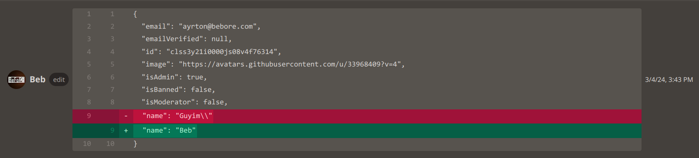

> API error
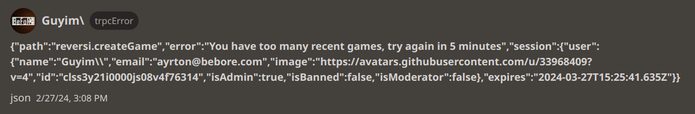

> User access attempt logging
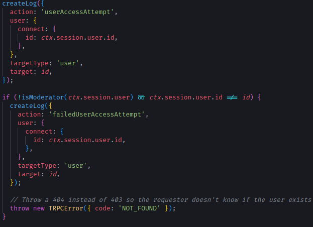

### Vercel logging
Vercel, waar de server gehost wordt, logt ook elke request die er binnen komt. Hier gaat het meer om de informatie rond Vercel dan info over de request zelf. Je kan bijvoorbeeld zien als er iets fout gaat waar het fout gaat, maar je kan niet het IP van de requester zien etc. Dit kan uitgebreid worden door te betalen voor Vercel, als je dit doet krijg je nog fijnere logging. 

> Overview
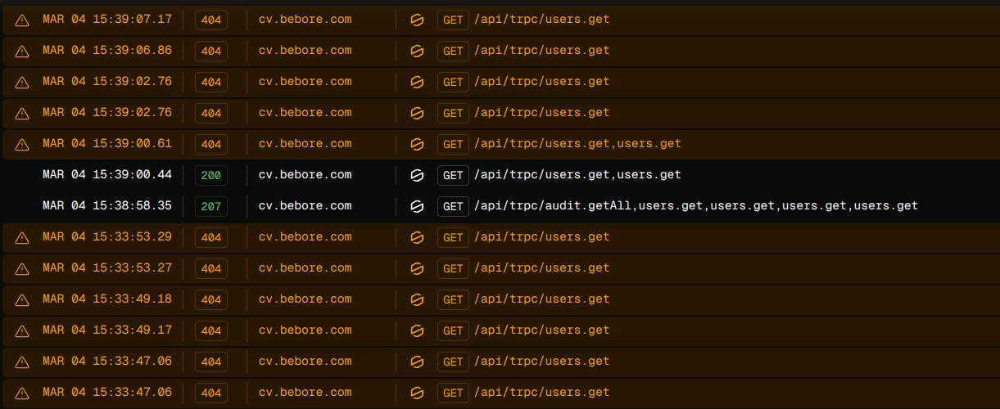

> Detail
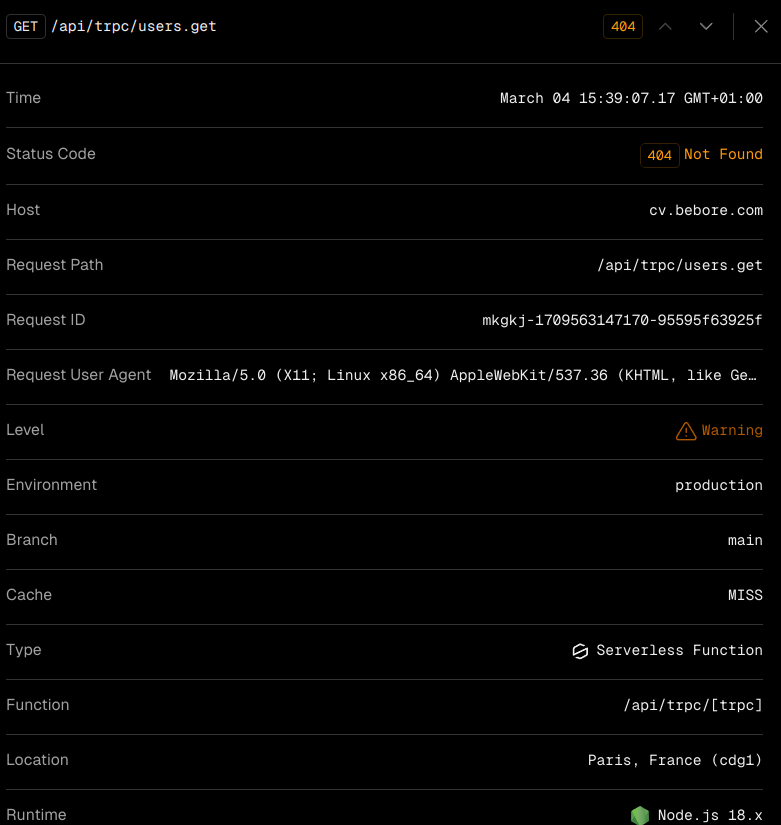

## Input validation
Omdat ik gebruik maak van tRPC moet er voor elke API endpoint waar input voor gegeven moet worden een schema hiervoor gedefineerd worden met welke data de endpoint verwacht. Voor elke request die gemaakt wordt naar een endpoint wordt eerst gecontrolleerd of de input wel overeen komt met de schema. De vorm van de schema wordt ook gebruikt om te zorgen dat er niet extra velden meegesmokkelt kunnen worden.

Voor alle schema's worden er ook limieten vastgesteld, bijvoorbeeld als je jou gebruikers naam wil veranderen kan deze niet meer zijn dan 20 karakters.

> Schema voorbeeld
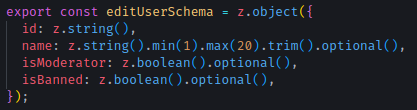

> API endpoint

tRPC controlleert (nu wel sinds ik er een issue van gemaakt heb op hun GitHub) niet of de Content-Type header wel van type `application/json` was, dit doe ik nu handmatig, dit maakt het ook moeilijker om CSRF uit te voeren.

## Access Control

Access control word op meerdere manieren afgedwongen. Role guards en procedures. Je kan hier meer over lezen in het [technisch ontwerp (3.5.)](/docs/technischOntwerp.md).

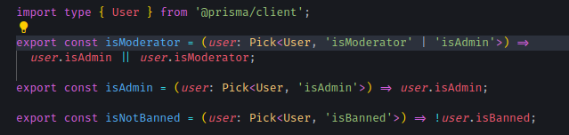

Voor het controleren wie admin is of moderator etc. hebben we ervoor gekozen om dit te doen in een functie, zodat wanneer de definitie van een admin of moderator veranderd, dit niet overal veranderd hoeft te worden.

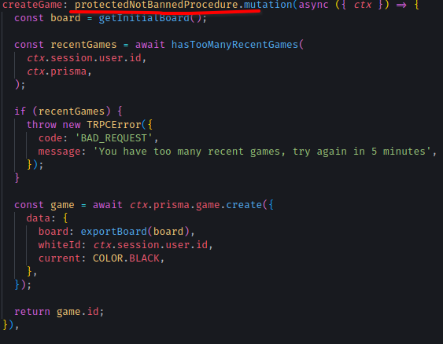

Deze endpoint kan niet aangeroepen worden door iemand die verbannen is.

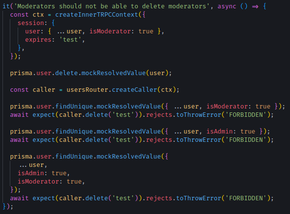

Access control wordt getest doormiddel van intergration tests.

## CSRF Preventie

### Auth

Voor auth maken we gebruik van NextAuth, NextAuth zorgt er zelf voor dat er geen CSRF aanvallen uitgevoerd kunnen worden bij het inloggen. Dit wordt gedaan doormiddel van een CSRF token. Dit gebeurt automatisch.

### API

Voor de API controleer ik bij elke request of de request wel vanaf onze website komt. Dit gebeurt doormiddel van het controleren van de origin of referer header zoals beschreven op de [OWASP Cheatsheet over CSRF](https://cheatsheetseries.owasp.org/cheatsheets/Cross-Site_Request_Forgery_Prevention_Cheat_Sheet.html#using-standard-headers-to-verify-origin). Ik heb hiervoor gekozen omdat het een simpelere manier is om CSRF te voorkomen dan CSRF-tokens, en deze techniek werkt omdat we van tevoren weten wat de origin's zijn van onze API.

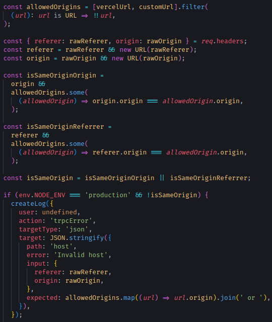

Ik maak gebruik van de URL klasse om te voorkomen dat wannneer aanvallers een URL gebruiken zoals cv.bebore.com.org deze vergelijking ook fout gaat.

## XSS preventie

Met de contact vorm kunnen bezoekers een email sturen naar mij. Hier wordt gebruikers input in de html van de email verwerkt. Om te verkomen dat de aanvaller de email vervormt wordt er gebruik gemaakt van sanitatie. Hierbij maak ik gebruik van `escape-html-template-tag` zodat ik de gebruikers input in een template string kan zetten en deze dan automatisch escaped word. Hierdoor hoef ik niet handmatig voor elke plek waar input wordt gegeven te controleren of het wel veilig is. Dit verkleint de kans op fouten.

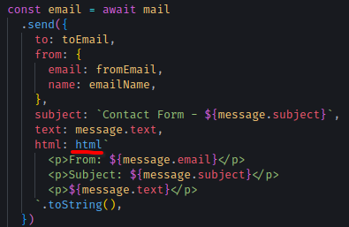

Gebruikers input op schermen hoeft niet gesaniteerd te worden, omdat we gebruik maken van React.

## Headers

Voor elke request worden er ook headers toegevoegd om de kans op bepaalde aanvallen te verminderen. Het gaat hier om clickjacking, XSS mitigation, MitM aanvallen.

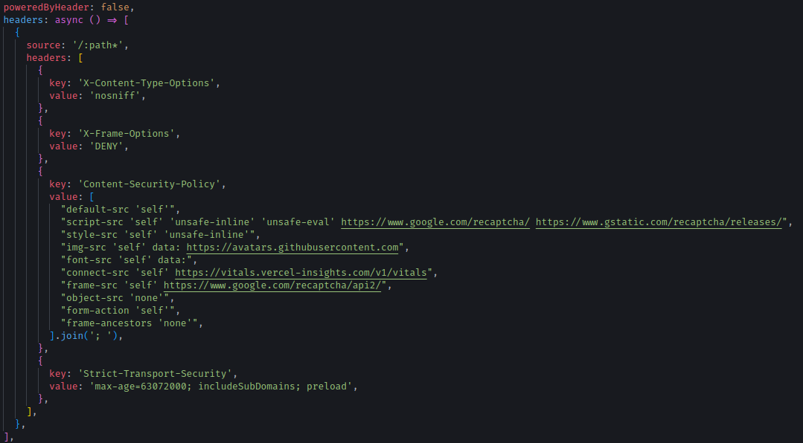

## Safe output

Op pagina's zoals het Reversi spel scherm, word de informatie van andere spelers laten zien. Hierbij is alleen de gebruikersnaam en avatar van de andere speler belangrijk. Om te voorkomen dat er informatie gelekt wordt die niet gelekt mag worden, wordt er alleen de essentiele informatie naar de client gestuurd. Dit vangen we af met een safeUser functie. Om informatie zoals email te sturen naar de client moet dit expliciet worden aangegeven in de safeUser functie.

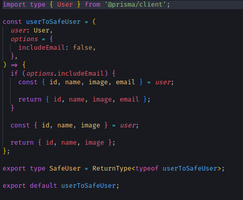

Hiervoor zijn ook tests geschreven.

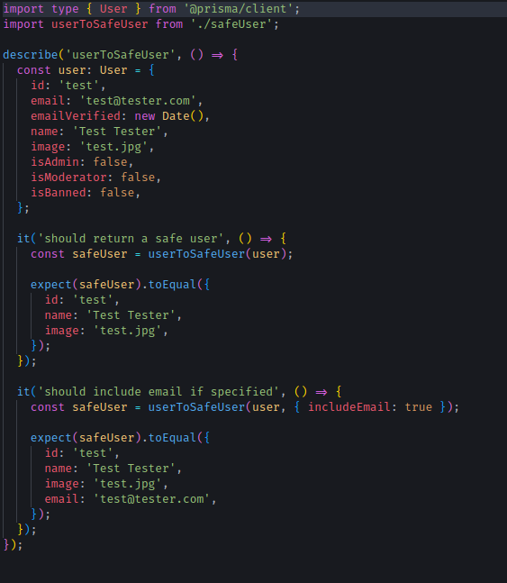
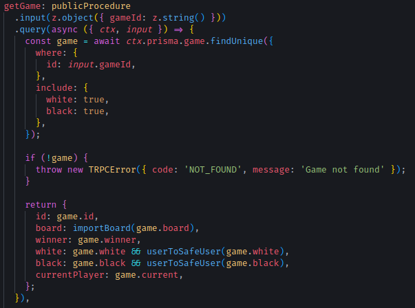
