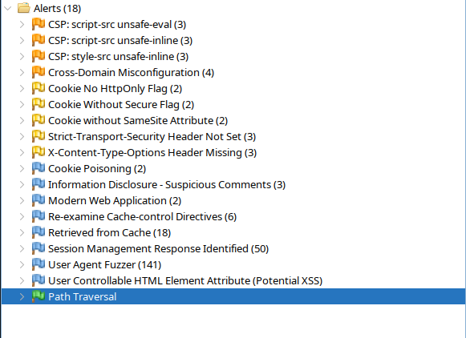

# ZAP Scan

## Aanpak

1. Start ZAP
2. Voeg proxy instellingen toe aan browser
3. Voeg context toe
4. Navigeer naar de website
5. Voeg sessie token toe als login indicator
6. Voer acties uit op de website (incl. inloggen, spelen van een spel, aanpassen van profiel, etc.)
7. Voeg sessie toe als user
8. Voeg website toe aan context
9. Voer scan uit als user

## Resultaten

De scan heeft een paar alerts gevonden. De gevonden alerts zijn niet zorgwekkend en hier hoeven geen acties voor ondernomen te worden. De CSP waarschuwingingen zijn, omdat er voor ReCaptcha unsafe flags nodig zijn voor de functionaliteit. De CORS waarschuwing kunnen ook negeerd worden, op de gevonden paden worden geen acties uitgevoerd, dus de waarschuwingen zijn een false positive. Het hoofdscherm maakt gebruik van een visited cookie, deze hoeft niet beveiligd te worden.

Ook was er een path traversal gevonden, dit is een false positive.

Suspicious comments lekken ook geen informatie uit.

## Conclusie
De website is veilig en er hoeven geen acties ondernomen te worden.
