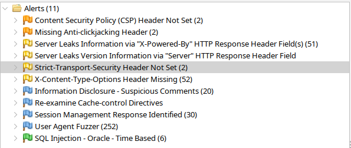

# ZAP Scan

## Aanpak

1. Start ZAP
2. Voeg proxy instellingen toe aan browser
3. Voeg context toe
4. Navigeer naar de website
5. Voeg sessie token toe als login indicator
6. Voer acties uit op de website (incl. inloggen, spelen van een spel, aanpassen van profiel, etc.)
7. Voeg sessie toe als user
8. Voeg website toe aan context
9. Voer scan uit als user

## Scan CV Showcase
Dit is de laatste scan van de showcase website.

### Resultaten

De scan heeft een paar alerts gevonden. De gevonden alerts zijn niet zorgwekkend en hier hoeven geen acties voor ondernomen te worden. De CSP waarschuwingingen zijn, omdat er voor ReCaptcha unsafe flags nodig zijn voor de functionaliteit. De CORS waarschuwing kunnen ook negeerd worden, op de gevonden paden worden geen acties uitgevoerd, dus de waarschuwingen zijn een false positive. Het hoofdscherm maakt gebruik van een visited cookie, deze hoeft niet beveiligd te worden.

Ook was er een path traversal gevonden, dit is een false positive.

Suspicious comments lekken ook geen informatie uit.

### Conclusie
De website is veilig en er hoeven geen acties ondernomen te worden.

## Scan ei Noah

Ook heb ik een scan uitgevoerd voor een website van een ander persoonlijk project van mij. https://ei.sweaties.net

### Resultaten

Deze scan heeft meerdere beveiligingsproblemen gevonden. Zo is er bijvoorbeeld gevonden dat er geen gebruik gemaakt wordt van Content Security Policy, waardoor de impact van een XSS aanval groter kan zijn. Ook zijn er geen preventies in plaats tegen anti-clickjacking. Tevens lekt de website informatie over de server, wat een aanvaller kan helpen bij het uitvoeren van een aanval. De subscriptie service met WebSocket heeft geen Strict-Transport-Security header, waardoor de kans op een MITM aanval groter is. 

Verder geeft de scan ook een SQL-injection vulnerability aan voor MySQL (aanname). De applicatie maakt geen gebruik van Oracle producten, dus dit waarschijnlijk een false positive, of er is een third-party service die blootligt, maar dit is onwaarschijnlijk.

### Conclusie
De website heeft een aantal beveiligingsproblemen die opgelost moeten worden.

1. [Content Security Policy toevoegen](https://developer.mozilla.org/en-US/docs/Web/HTTP/CSP)
2. [Anti-clickjacking maatregelen toevoegen](https://cheatsheetseries.owasp.org/cheatsheets/Clickjacking_Defense_Cheat_Sheet.html)
3. Server informatie verbergen
4. [Strict-Transport-Security header toevoegen](https://cheatsheetseries.owasp.org/cheatsheets/HTTP_Strict_Transport_Security_Cheat_Sheet.html) aan subscriptie service
5. SQL-injection vulnerability verder onderzoeken
